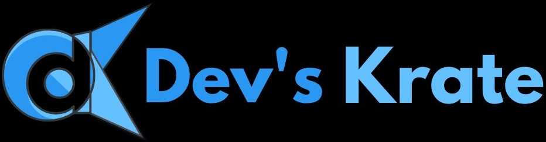
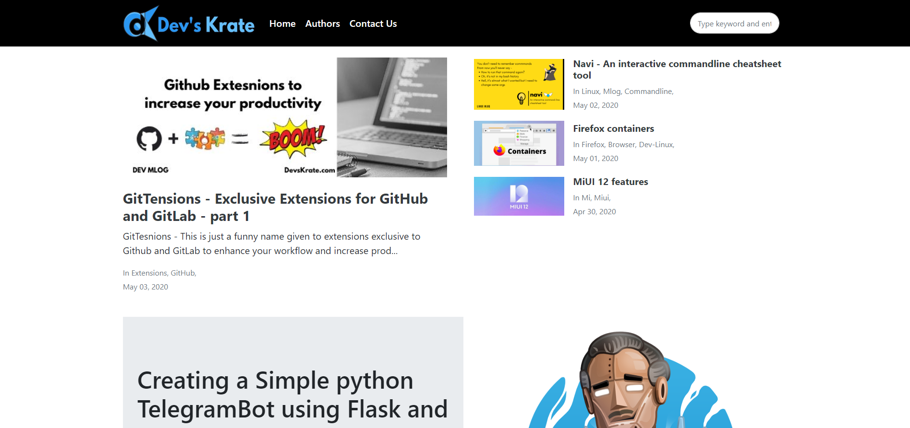
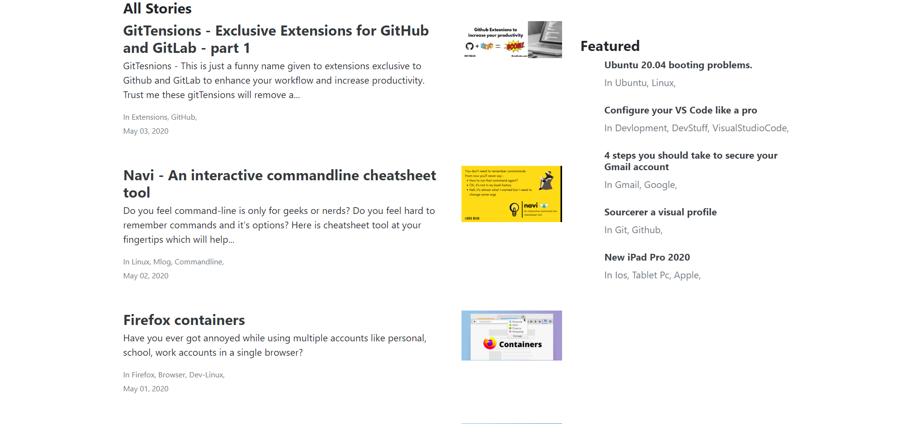

<!-- PROJECT SHIELDS -->
<!--
*** I'm using markdown "reference style" links for readability.
*** Reference links are enclosed in brackets [ ] instead of parentheses ( ).
*** See the bottom of this document for the declaration of the reference variables
*** for contributors-url, forks-url, etc. This is an optional, concise syntax you may use.
*** https://www.markdownguide.org/basic-syntax/#reference-style-links
-->
[![Contributors][contributors-shield]][contributors-url]
[![Forks][forks-shield]][forks-url]
[![Stargazers][stars-shield]][stars-url]
[![Issues][issues-shield]][issues-url]

<!--
[![MIT License][license-shield]][license-url]
[![LinkedIn][linkedin-shield]][linkedin-url]
-->


<!-- PROJECT LOGO -->
<br />
<p align="center">
  <a href="https://devskrate.com">
    
  </a>

  <!--<h3 align="center">Best-README-Template</h3>-->
<!--
  <p align="center">
  Here at <a href="https://devskrate.com">DevsKrate</a> we inspire and endeavor to share everything about technology like Softwares, Coding, etc., and provide our best about HOW TO tutorials and BEST OF every category in accordance to our knowledge.
    <br />
  
    <a href="https://github.com/othneildrew/Best-README-Template"><strong>Explore the docs »</strong></a>
    <br />
    <br />
    <a href="https://github.com/othneildrew/Best-README-Template">View Demo</a>
    ·
    <a href="https://github.com/othneildrew/Best-README-Template/issues">Report Bug</a>
    ·
    <a href="https://github.com/othneildrew/Best-README-Template/issues">Request Feature</a>

  </p>
  -->
</p>


<!-- TABLE OF CONTENTS -->
## Table of Contents

* [About the Project](#about-the-project)
  * [Built With](#built-with)
* [Getting Started](#getting-started)
  * [Prerequisites](#prerequisites)
  * [Installation](#installation)
<!--* [Usage](#usage)-->
* [Roadmap](#roadmap)
* [Contributing](#contributing)
* [Our Core Contributors](#our-core-contributors)
* [License](#license)
* [Contact](#contact)
<!--* [Acknowledgements](#acknowledgements)-->


<!-- ABOUT THE PROJECT -->
## About The Project

<!--[![Product Name Screen Shot][product-screenshot]](https://example.com)-->



<p align="center">
  Here at <a href="https://devskrate.com">DevsKrate</a> we inspire and endeavor to share everything about technology like Softwares, Coding, etc., and provide our best about HOW TO tutorials and BEST OF every category in accordance to our knowledge.
    <br />
  </p>



A list of commonly used resources that I find helpful are listed in the acknowledgements.

### Built With
The major frameworks used to build DevsKrate are
* [HTML](https://www.w3.org/html/)
* [CSS](https://www.w3.org/Style/CSS/Overview.en.html)
* JavaScript
* [Jekyll](https://jekyllrb.com/)


<!-- GETTING STARTED -->
## Getting Started

This is an example of how you may give instructions on setting up your project locally.
To get a local copy up and running follow these simple example steps.

### Prerequisites

This is an example of how to list things you need to use the software and how to install them.
* npm
```sh
npm install npm@latest -g
```

### Installation

1. Get a free API Key at [https://example.com](https://example.com)
2. Clone the repo
```sh
git clone https://github.com/your_username_/Project-Name.git
```
3. Install NPM packages
```sh
npm install
```
4. Enter your API in `config.js`
```JS
const API_KEY = 'ENTER YOUR API';
```


<!-- USAGE EXAMPLES   -->
<!--
## Usage
-->
<!--
Use this space to show useful examples of how a project can be used. Additional screenshots, code examples and demos work well in this space. You may also link to more resources.
-->

<!-- ROADMAP -->
## Roadmap

See the [open issues](https://github.com/othneildrew/Best-README-Template/issues) for a list of proposed features (and known issues).


<!-- CONTRIBUTING -->
## Contributing

Contributions are what make the open source community such an amazing place to be learn, inspire, and create. Any contributions you make are **greatly appreciated**.

1. Fork the Project
2. Create your Feature Branch (`git checkout -b feature/AmazingFeature`)
3. Commit your Changes (`git commit -m 'Add some AmazingFeature'`)
4. Push to the Branch (`git push origin feature/AmazingFeature`)
5. Open a Pull Request


<!--Core Contributors-->
## Our Core Contributors

Neerukonda Puneeth - [@puneeth_kanna](https://twitter.com/puneeth_kanna) - neerukondapuneeth@gmail.com  
Indukuri Mohit - [@indukuri_mohit](https://twitter.com/indukuri_mohit) - indukurimohit@gmail.com  
Nikhil Reddy Pyreddy - [@NPyreddy](https://twitter.com/NPyreddy) - nikhilkumarreddypyreddy@gmail.com  
Sri Satya Lokesh Karri - [@CodeWithSathya](https://twitter.com/CodeWithSatya) - srisathyalokesh@gmail.com  


<!-- LICENSE -->
## License

Distributed under the MIT License. See `LICENSE` for more information.


<!-- CONTACT -->
## Contact

If you’d like to get in touch with us, feel free to write us at support@devskrate.com

Project Link: [https://github.com/devskrate/prod](https://github.com/devskrate/prod)


<!-- ACKNOWLEDGEMENTS -->
<!--
## Acknowledgements
* [GitHub Emoji Cheat Sheet](https://www.webpagefx.com/tools/emoji-cheat-sheet)
* [Img Shields](https://shields.io)
* [Choose an Open Source License](https://choosealicense.com)
* [GitHub Pages](https://pages.github.com)
* [Animate.css](https://daneden.github.io/animate.css)
* [Loaders.css](https://connoratherton.com/loaders)
* [Slick Carousel](https://kenwheeler.github.io/slick)
* [Smooth Scroll](https://github.com/cferdinandi/smooth-scroll)
* [Sticky Kit](http://leafo.net/sticky-kit)
* [JVectorMap](http://jvectormap.com)
* [Font Awesome](https://fontawesome.com)
-->


<!-- MARKDOWN LINKS & IMAGES -->
<!-- https://www.markdownguide.org/basic-syntax/#reference-style-links -->
[contributors-shield]: https://img.shields.io/github/contributors/othneildrew/Best-README-Template.svg?style=flat-square
[contributors-url]: https://github.com/othneildrew/Best-README-Template/graphs/contributors
[forks-shield]: https://img.shields.io/github/forks/othneildrew/Best-README-Template.svg?style=flat-square
[forks-url]: https://github.com/othneildrew/Best-README-Template/network/members
[stars-shield]: https://img.shields.io/github/stars/othneildrew/Best-README-Template.svg?style=flat-square
[stars-url]: https://github.com/othneildrew/Best-README-Template/stargazers
[issues-shield]: https://img.shields.io/github/issues/othneildrew/Best-README-Template.svg?style=flat-square
[issues-url]: https://github.com/othneildrew/Best-README-Template/issues
[license-shield]: https://img.shields.io/github/license/othneildrew/Best-README-Template.svg?style=flat-square
[license-url]: https://github.com/othneildrew/Best-README-Template/blob/master/LICENSE.txt
[linkedin-shield]: https://img.shields.io/badge/-LinkedIn-black.svg?style=flat-square&logo=linkedin&colorB=555
[linkedin-url]: https://linkedin.com/in/othneildrew
[product-screenshot]: images/screenshot.png
